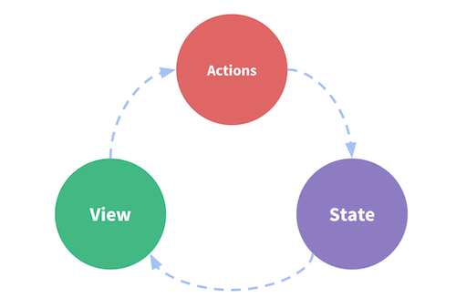

# Application state persistance in Vue.js

## [github.com/szkrd/](https://github.com/szkrd/)

---
---

## Vue.js

* nice [guide](http://vuejs.org/guide/)
* data binding (mostly two-way)
* uses getters/setters (others: fn, dirty check, proxies)
* computed props, deep watching
* virtual dom
* filters, directives, components
* v-model

---
---

## Example

https://jsfiddle.net/szabi/xm2bkgn6/

```html
<div id="app">
  Hello {{ name }}!<br>
  <input type="text" v-model="name">
</div>
```

```js
new Vue({
  el: '#app',
  data: () => ({ name: 'John' })
})
```

---
---

## Vue 1 vs Vue 2

* lots of small things were removed
* new lifecycle hooks
* no more two way props (or prop mutations)
* no more partials
* directives are simpler (and are not instanciated)
* event model (total overhaul, no more dispatch or broadcast, on/emit is for self)
* filters are for text modifications (no more v-for, v-model etc.)
* interpolation inside attributes (`<b class="icon-{{ type }}"></b>`)

---
---

## Solutions

* stuff removed :arrow_right: migration assistant
* lifecycle changes :arrow_right: created, mounted, destroyed
* two way props :arrow_right: whoops, maybe event emissions?
* partials :arrow_right: functional components, webpack includes
* directives :arrow_right: whoops, rethink your directives
* event model :arrow_right: whoops, use an eventbus or a store
* filters :arrow_right: use computed observables
* interpolation :arrow_right: use computed observables

---
---

## Event models

1. parent-child messaging
2. eventbus
3. (shared observable store)
4. (flux-style store)

---
---

## Event model: parent-child

* one level!
* down: prop
* up: event

https://jsfiddle.net/szabi/u1Lthsp9/

```
    ┌-------------┐
    |    Parent   |
    └-------------┘
      ▲         |
  evt |         | prop
      |         ▼
    ┌-------------┐
    |    Child    |
    └-------------┘
```

---
---

## Event model: eventbus

* up vs down: vue1 (dispatch vs broadcast)
* uniformed broadcaster:
  * vue2: `new Vue()`
  * node EventEmitter (using webpack/browserify)
  * html Custom Event on document

---
---

### EventEmitter example


```js
const EventEmitter = require('events')
class EventBus extends EventEmitter {}
export default new EventBus()
```

* Fire: `eventBus.emit('errorEvent', 0)`
* Listen: `eventBus.on('errorEvent', code => console.error(code))`

---
---

## Eventbus in action


```
     ┌-------------┐
 ┌--▷| fare finder | --------------------┐ --------------------------┐
 |   └-------------┘                     |                           |
 |E    |P                                |                           |
 |     ▼                                 ▼                           ▼
 |   ┌-------------------┐              ┌---------------------┐     ┌---------------------┐
 △   |   sidebar         |              |  calendar           |     |  calendar           |
 |   └-------------------┘              └---------------------┘     └---------------------┘
 |     |              |                   |                |         |                 |
 |     ▼              ▼                   ▼                ▼         ▼                 ▼
 |   ┌-------------┐┌-------------┐     ┌----------------┐┌------┐  ┌----------------┐┌------┐
 △-  | flight card || flight card |     | monthly prices || days |  | monthly prices || days |
 |   | (outbound)  ||  (return)   |     └----------------┘└------┘  └----------------┘└------┘
 |   └-------------┘└-------------┘
 △
 └- ---- --- -- -

```

---
---

* props are travelling down via one-way binders
* minimize broadcasts in root
  * we have one for locking the UI state though
  * may be useful for great distances
* state handling in topmost component (app)
* everyone can hop on the bus
* for small applications / pages

---
---

## the app can sync the state

```js
{
    data: () => getSessionItem(SESSION_KEY) || defaultData,
    watch: {
        $data: {
            handler: val => setSessionItem(SESSION_KEY, val),
            deep: true
        }
    }
}
```

## Caveats

* reloading may not "fix" the application anymore
* tainted store problem
* flush (local) store on new release (new version)

---
---

## The elephant in the room: state in the url

* dealing with back/forward/reload :left_right_arrow: spa
* the app handles the truth :arrow_right: simple
* the url handles the (full) state :arrow_right: simple
* browser friendly urls
  * html5 history: isomorphicity is HARD
  * hashbang/hashurl
* urls + stores = HARD

---
---

## Mixing sources

* application resiliency (working is better than perfect)
* url + local storage
* url + app state
  * variables in the url
  * variables in the state
  * redundancy (state > url)

---
---

## Shared observable store

* single source of truth
* world writable
* small to medium sized applications
* `v-if` is your friend (vs. computeds)

---
---

## Shared observable store

* https://jsfiddle.net/szabi/ye5zrw6f/
* computed observables may be used for shortcuts (with setters)
  * linker factory mixin
  * probably as a plugin
* may or may not use actions
* changes are untrackable
* there is no "gateway" to the store
* it's still trivial to store the state in session storage

---
---


> photo by afflictedmonkey: [Message in a Bamboo tree](https://www.flickr.com/photos/afflictedmonkey/5510851980/in/photolist-9oYyij-kfqFAT-oSWDU3-3eajqb-dm5UH3-dm5UAC-8vwpdX-naezqW-4Wx2Mq-ncjcMS-7AS9Mo-8vwp2X-nchkcK-6sEFqJ-2S4uUi-dm5QiH-65p6Gq-dm5SMX-dm5WZw-ncgY1M-4Wx3uo-dm5Utm-nciR8W-naeym6-ncjca9-nch49e-nch3Et-naeeV9-ncgXoz-rZQzf-dm5Qqv-naecVM-naeAfG-dm5Uqw-6aGZW-dm5Qmz-ncjdcE-dm5QgP-dm5UF9-naef45-LPuwi-nciRd5-59LhKn-naeAU3-8vwpgg-ncjcnJ-dm5UrN-8vwp5z-8vwp8V-4BNSep)

---
---

## Flux style store

* the store can not be written to directly
* app - action - mutation - store
* even if we implement actions and mutations, the store is still vulnerable
  * discipline?
  * framework level! (vuex, redux, flux etc.)
* large scale applications



---
---

1. on click
2. view calls viewmodel's method
3. method is an alias for an __action__ in the viewmodel
4. action has the business logic, dispatches __mutations__
5. mutation modifies the __state__
6. the state propagates to all views

Example: https://jsfiddle.net/szabi/davn5bbp/

---
---

## Questions?